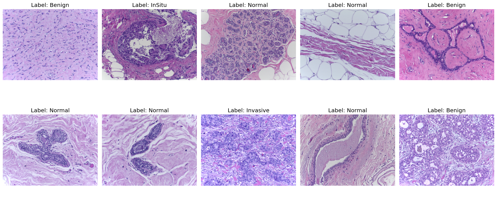

# SEANet15: A Self-Attention-Based Squeeze and Excitation Networks for Lymphatic Node Cancerous Tissue Classification Using Histopathology Images

## Overview

This repository contains the implementation of the **SEANet15** model, a novel deep neural architecture optimized for both binary and multiclass classification of medical images. The model integrates a 15Layer Custom CNN incorporated with squeeze-and-excitation (SE) mechanisms and Self-Attention to achieve state-of-the-art performance on several medical image datasets.

*Figure 1: Architecture of SEANet15.*

## Key Features

- **Model Architecture**: SEANet15 incorporates the SE mechanism alongside the a 15leayer Custom CNN backbone and Self-Attention layers, improving both feature extraction and classification accuracy.
- **Binary Classification**: Achieved exceptional accuracy on the PCam and BreakHIS datasets for distinguishing metastatic from non-metastatic lymph node tissue.
  - **PCam dataset**: 99.98% accuracy
  - **BreakHIS dataset**: 100% accuracy (across all magnification levels)
- **Multi-class Classification**: Demonstrated superior performance in categorizing cancerous tissues into distinct classes across multiple datasets.
  - **BreakHIS dataset**: 98.50%(40x), 97.05(100x), 97.99(200x) and 98.42(400x) accuracy across 8 classes and multiple magnifications (40x, 100x, 200x, 400x)
  - **BACH dataset**: 100% accuracy across 4 distinct classes
- **Versatility Across Datasets**: Validated on three diverse medical datasets: PCam (lymph node sections), BreakHIS (breast cancer histopathology images), and BACH (breast tissue histology).

## Datasets

The model was trained and tested on the following datasets:
- **PCam**: PatchCamelyon dataset, focused on lymph node section images for binary classification of metastatic vs non-metastatic tissues.
  
*Figure 2: PCam Dataset.*
- **BreakHIS**: Breast Cancer Histopathological Image Classification dataset, used for both binary and multiclass classification tasks across various magnifications (40x, 100x, 200x, 400x).
  
*Figure 2: BreakHIS Dataset.*
- **BACH**: Breast Cancer Histology Challenge dataset, used for multiclass classification of breast tissue histology.
  
*Figure 2: BACH Dataset.*

## Model Performance

- **Binary Classification**:
  - PCam: **99.98%**
  - BreakHIS: **100%** (all magnification levels)
  
- **Multi-class Classification**:
  - BreakHIS: **98.50%(40x), 97.05(100x), 97.99(200x) and 98.42(400x)** (8 classes)
  - BACH: **100%** (4 classes)

## Installation

### Set up the environment:

We recommend using a virtual environment or Conda to manage dependencies.

```bash
# Create a new conda environment with Python 3.8
conda create -n seresnet50sa python=3.8
# Activate the environment
conda activate seresnet50sa
```

### Install dependencies:

Install the required packages using `requirements.txt`.

```bash
pip install -r requirements.txt
```

## Usage

### Training the Model

To train the model on your local machine, execute the following command:

```bash
python train.py --dataset <dataset_name> --epochs <num_epochs> --batch_size <batch_size> --magnification <magnification_level>
```

Example:

```bash
python train.py --dataset PCam --epochs 50 --batch_size 32
```

### Evaluation

To evaluate the trained model on test datasets:

```bash
python evaluate.py --dataset <dataset_name> --magnification <magnification_level>
```

Example:

```bash
python evaluate.py --dataset BreakHIS --magnification 100x
```

### Configuration

You can adjust the hyperparameters, paths, and other configurations in the `config.yaml` file (If you use straight forward process as for modeling) or use the notebook process for integrate with the conda or jupyter notebook.

## Results

The SEANet15 model has consistently outperformed traditional deep learning models by leveraging SE blocks and attention mechanisms, ensuring high precision and reliability in cancer tissue classification across multiple datasets.

- **PCam**: 99.98% accuracy
- **BreakHIS**: 100% accuracy (binary), 98.50%(40x), 97.05(100x), 97.99(200x) and 98.42(400x) accuracy (multi-class)
- **BACH**: 100% accuracy

## Citation

If you use this code for your research, please consider citing the following paper:

```bibtex
@article{hasan2024seanet15,
  title={SEANet15: A Self-Attention-Based Squeeze \& Excitation Networks for Lymphatic Node Cancerous Tissue Classification Using Histopathology Images},
  author={Md. Mahedi Hasan Joy, Muhammad Nazrul Islam, Mohammad Ali Moni, Ashery Mbilinyi, Yasushi Inoguchi, Faiz Al Faisal},
  journal={to be announced},
  year={2024},
  volume={xx},
  pages={xx--xx}
}
```

## License

This project is licensed under the MIT License - see the [LICENSE](LICENSE) file for details.

